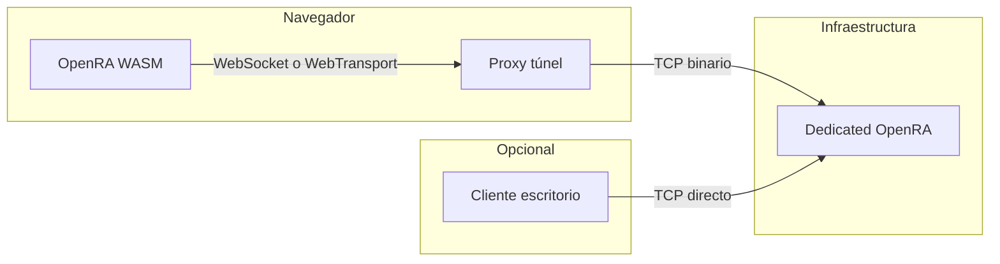

# Multijugador en navegador — Arquitectura y alcance

Este documento define el **qué** y el **cómo a alto nivel**. Los detalles del proxy y del motor están en [02-proxy-and-infrastructure.md](./02-proxy-and-infrastructure.md) y [03-client-engine-implementation.md](./03-client-engine-implementation.md).

## 1. Objetivo

Permitir que un jugador **entre (join)** a una partida online ya existente desde el cliente **OpenRA en WebAssembly**, sin necesidad de crear salas ni replicar el flujo completo de multijugador de escritorio.

## 2. Fuera de alcance (v1)

- Crear servidor / sala desde el navegador (`ServerCreationLogic`, host local público).
- Listado del master server (`master.openra.net/games`) dentro del juego web — opcional en fases posteriores.
- Sustituir el servidor dedicado: el **game server** sigue siendo el binario OpenRA actual con `TcpListener`.

## 3. Actores y responsabilidades

| Componente | Rol |
|------------|-----|
| **Servidor dedicado OpenRA** | Autoridad de juego, lobby, lockstep; escucha TCP (puerto habitual del mod). |
| **Proxy de túnel** | Termina WebSocket o WebTransport en internet; mantiene un `TcpClient` hacia el dedicado y reenvía bytes en ambos sentidos. |
| **Cliente WASM** | Misma lógica de juego que escritorio; sustituye `TcpClient` por una implementación de `IConnection` sobre el transporte browser. |
| **Sitio web (Blazor/static)** | Sirve el WASM, puede pasar URL del túnel / query string / token de join. |

## 4. Diagrama de flujo

El protocolo de aplicación entre cliente y servidor **no cambia**: es el mismo stream que hoy usa `NetworkConnection` sobre TCP. Solo cambia el **transporte** entre el navegador y el proxy.

## 5. Principios de diseño

1. **Túnel transparente**: el proxy no interpreta paquetes OpenRA salvo si en el futuro se añade autenticación en el borde (entonces solo capas previas al handshake o metadatos fuera de banda).
2. **Una conexión lógica por jugador**: un WebSocket (o un stream bidireccional WebTransport) ↔ un socket TCP al dedicado.
3. **Join determinista**: la URL de conexión al proxy se conoce por configuración del sitio (no hace falta descubrimiento dinámico en v1).

## 6. Transporte: decisión de producto

| Opción | Cuándo usar |
|--------|-------------|
| **WebSocket (`wss`)** | Primera implementación: soporte amplio, balanceadores y operación conocidos. |
| **WebTransport (QUIC)** | Si se requiere QUIC, se dispone de stack HTTP/3 en el proxy y el público objetivo tiene soporte estable. |

En ambos casos el contenido es un **flujo de bytes fiable y ordenado** acorde al protocolo actual (no usar datagramas WT para el flujo principal del juego).

## 7. Mapas grandes y rendimiento

Independiente del multijugador:

- Memoria WASM y tiempo de carga de tiles/rules del mapa.
- Ya existe carga diferida en el fork (`BrowserCompleteMapLoadAsync`, `MapCache` con `OPENRA_BROWSER`).

La especificación de optimización de mapas grandes es trabajo de **perfilado** tras tener join estable; no bloquea el diseño del túnel.

## 8. Referencias en el código (fork)

- Cliente TCP actual: `OpenRA.Game/Network/Connection.cs` (`NetworkConnection`).
- Join: `OpenRA.Game/Game.cs` (`JoinServer`).
- Loopback browser (no TCP): `OpenRA.Game/Network/LoopbackNetworkConnection.cs`, `Game.CreateBrowserLoopbackLocalServer`.
- Servidor: `OpenRA.Game/Server/Server.cs`.

## 9. Orden de implementación sugerido

1. Proxy mínimo WebSocket → TCP y prueba con cliente de escritorio sustituido por `nc` o herramienta raw (validar bytes).
2. `IConnection` browser + integración `JoinServer` en WASM.
3. Flujo de producto join-only (URL / query).
4. Endurecimiento (TLS, límites, reconexión, auth en borde si aplica).
5. (Opcional) WebTransport, lista master en web, mapas grandes bajo perfilado.

## 10. Guía operativa (dedicado + proxy + navegador)

Pasos concretos y variables: [04-configuracion-multijugador-desde-el-navegador.md](./04-configuracion-multijugador-desde-el-navegador.md).
